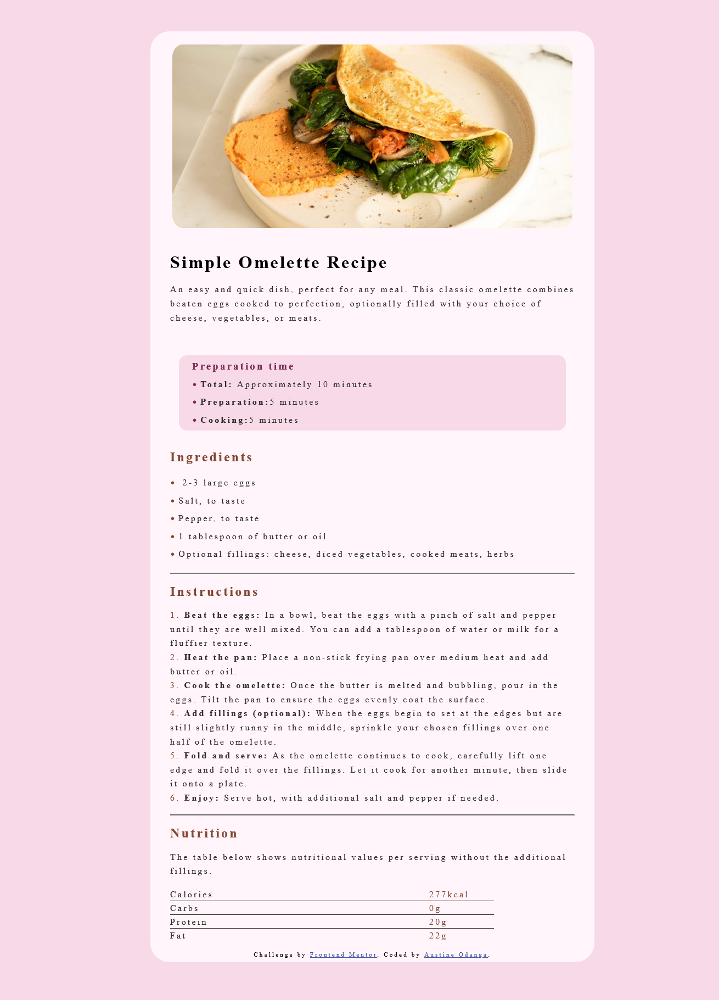

## overview
This is a solution to the [Recipe page challenge on Frontend Mentor](https://www.frontendmentor.io/challenges/recipe-page-KiTsR8QQKm).

## the-challenge

A simple omlette recipe landing page using HTML and CSS
## screenshot

## built-with
HTML.
CSS Grid.
Mobile first-workflow.

##  what-i-learned
During this challange I learned how to create a mobile layout and a desktop layout separately.
Hahaha and I chose to settle for mobile-first process.
## author